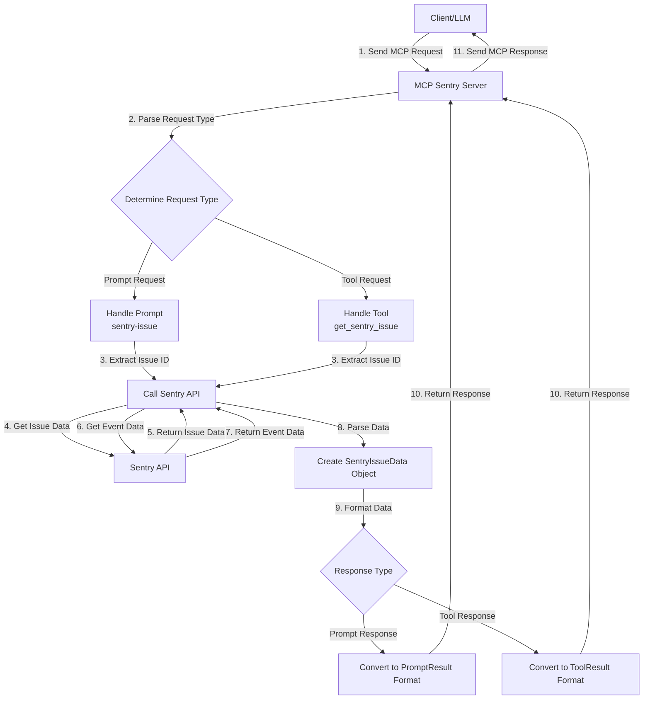

# MCP Sentry Server (Node.js)

This is a Node.js + TypeScript implementation of the Model Context Protocol (MCP) Sentry server. It provides integration with Sentry for retrieving error reports and stacktraces through MCP.

[中文文档](./README_CN.md)

## Prerequisites

- Node.js >= 20.0.0
- pnpm >= 10.5.2

## Installation

Clone the repository and install dependencies:

```bash
pnpm install
```

## Configuration

Create a `.env` file in the root directory with your Sentry authentication token:

```
SENTRY_TOKEN=your_sentry_auth_token_here
```

You can obtain your Sentry authentication token from your Sentry account settings.

## Usage

### Build the Project

```bash
pnpm build
```

### Run the Server

```bash
pnpm start
```

Alternatively, you can specify the Sentry authentication token and API base as command-line arguments:

```bash
pnpm start --auth-token your_sentry_auth_token_here --api-base your_sentry_api_base_here
```

### Development Mode

```bash
pnpm dev
```

### MCP Configuration

```json
{
  "mcpServers": {
    "sentry-server": {
      "command": "npx",
      "args": ["@weekit/mcp-sentry"],
      "env": {
        "SENTRY_TOKEN": "your_sentry_auth_token_here",
        "SENTRY_API_BASE": "https://your_sentry_api_base_here"
      }
    }
  }
}
```

Using local build:

```json
{
  "mcpServers": {
    "my-sentry": {
      "command": "node",
      "args": ["path/to/dist/index.js"],
      "env": {
        "SENTRY_TOKEN": "your_sentry_auth_token_here",
        "SENTRY_API_BASE": "https://your_sentry_api_base_here"
      }
    }
  }
}
```

## Features

The MCP Sentry server provides the following features through the MCP protocol:

### Prompts

- `sentry-issue`: Retrieve a Sentry issue by ID or URL
- `most-triggered-issue`: Find the issue affecting the most users from a Sentry issues list URL

### Tools

- `get_sentry_issue`: Retrieve and analyze a Sentry issue by ID or URL
- `get_sentry_issues_list`: Retrieve and analyze a list of Sentry issues from a URL

## API

The server communicates using the Model Context Protocol over standard input/output streams and provides the following functionalities:

1. Listing available prompts and tools
2. Retrieving Sentry issue information including:
   - Issue title and ID
   - Status and severity level
   - First and last seen timestamps
   - Event count
   - Detailed stacktrace

## MCP Workflow

Below is the workflow diagram of the MCP Sentry server:



## Testing

Run all tests:

```bash
pnpm test
```

Run unit tests:

```bash
pnpm test test/unit.test.ts
```

Run integration tests:

```bash
pnpm test test/integration.test.ts
```

View test coverage:

```bash
pnpm test -- --coverage
```
