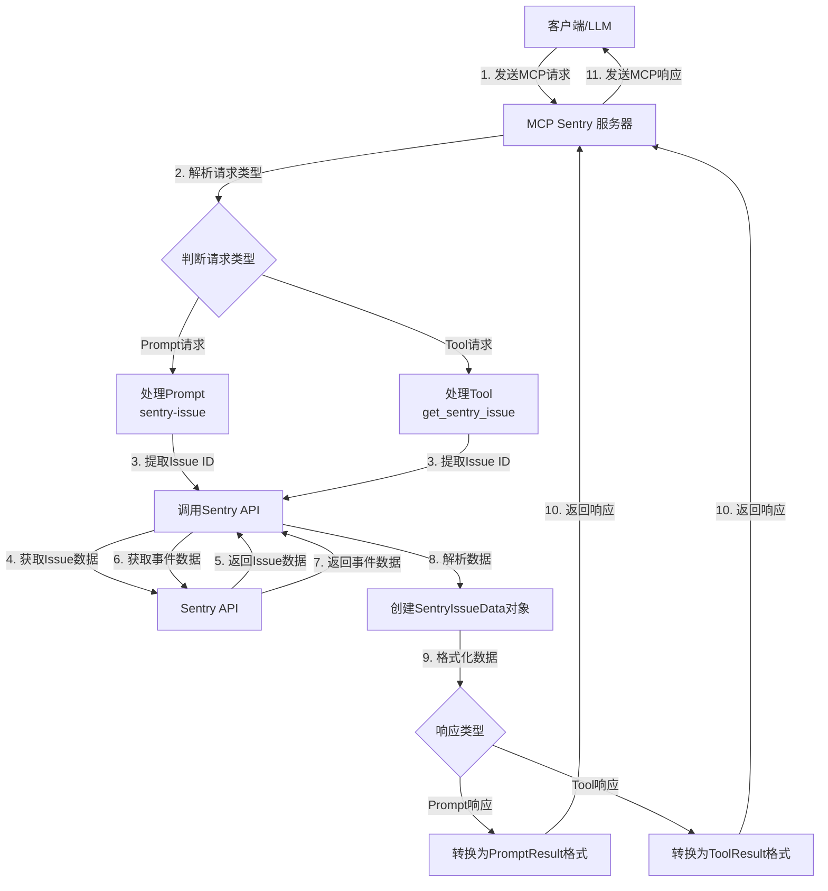

# MCP Sentry 服务器 (Node.js)

这是 Model Context Protocol (MCP) Sentry 服务器的 Node.js + TypeScript 实现。它通过 MCP 提供与 Sentry 集成，用于检索错误报告和堆栈跟踪。

[English Documentation](./README.md)

## 先决条件

- Node.js >= 20.0.0
- pnpm >= 10.5.2

## 安装

克隆仓库并安装依赖：

```bash
pnpm install
```

## 配置

在根目录中创建一个 `.env` 文件，其中包含您的 Sentry 认证令牌：

```
SENTRY_TOKEN=your_sentry_auth_token_here
```

您可以从 Sentry 账户设置中获取 Sentry 认证令牌。

## 使用方法

### 构建项目

```bash
pnpm build
```

### 运行服务器

```bash
pnpm start
```

或者，您可以通过命令行参数指定 Sentry 认证令牌和 BASE API：

```bash
pnpm start --auth-token=your_sentry_auth_token_here --api-base=your_sentry_api_base_here
```

### 开发模式

```bash
pnpm dev
```

### MCP 配置

```json
{
  "mcpServers": {
    "sentry-server": {
      "command": "npx",
      "args": ["@weekit/mcp-sentry"],
      "env": {
        "SENTRY_TOKEN": "your_sentry_auth_token_here",
        "SENTRY_API_BASE": "https://your_sentry_api_base_here"
      }
    }
  }
}
```

本地构建使用：

```json
{
  "mcpServers": {
    "my-sentry": {
      "command": "node",
      "args": ["path/to/dist/index.js"],
      "env": {
        "SENTRY_TOKEN": "your_sentry_auth_token_here",
        "SENTRY_API_BASE": "https://your_sentry_api_base_here"
      }
    }
  }
}
```

## 功能

MCP Sentry 服务器通过 MCP 协议提供以下功能：

### 提示 (Prompts)

- `sentry-issue`：通过 ID 或 URL 检索 Sentry 问题
- `most-triggered-issue`：从 Sentry 问题列表 URL 中查找影响最多用户的问题

### 工具 (Tools)

- `get_sentry_issue`：通过 ID 或 URL 检索和分析 Sentry 问题
- `get_sentry_issues_list`：从 URL 检索和分析 Sentry 问题列表

## API

服务器使用 Model Context Protocol 通过标准输入/输出流进行通信，并提供以下功能：

1. 列出可用的提示和工具
2. 检索 Sentry 问题信息，包括：
   - 问题标题和 ID
   - 状态和严重程度级别
   - 首次和最后一次出现的时间戳
   - 事件计数
   - 详细的堆栈跟踪

## MCP 工作流程

以下是 MCP Sentry 服务器的工作流程图：



## 测试

运行所有测试：
```bash
pnpm test
```

运行单元测试：
```bash
pnpm test test/unit.test.ts
```

运行集成测试：
```bash
pnpm test test/integration.test.ts
```

查看测试覆盖率：
```bash
pnpm test -- --coverage
```
